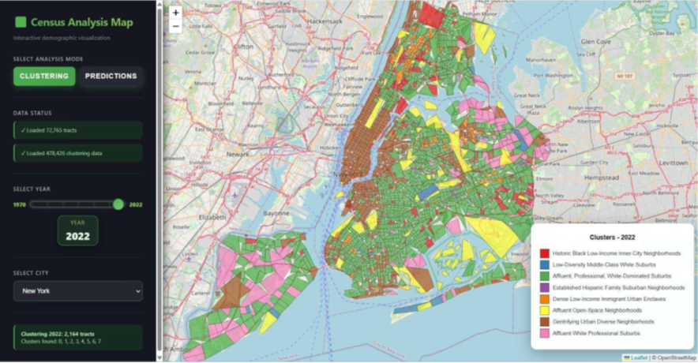
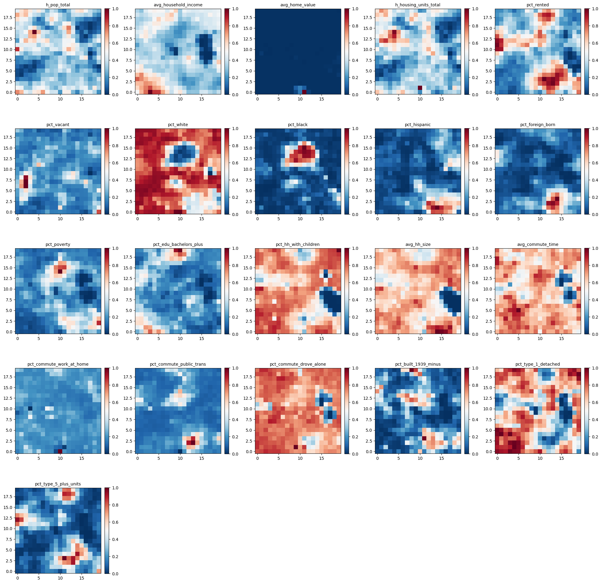

# U.S. City Neighborhood Archetypes

Identifying, forecasting, and visualizing U.S. neighborhood archetypes using Census data, machine learning, and interactive geospatial analytics.

---

## Project Overview

This project analyzes how U.S. city neighborhoods have evolved from **1970 to 2022** and forecasts their socioeconomic trajectories through **2070**. Using harmonized Census and ACS data at the census-tract level, we identify stable **neighborhood archetypes**, predict their long-term evolution, and visualize these dynamics through an interactive web-based map.

The project is designed to support **urban planners, policymakers, and data scientists** in understanding gentrification, demographic shifts, and long-term neighborhood change.

---

## Sample Visuals

  
*Interactive map showing neighborhood archetypes across U.S. census tracts.*

  
*Predicted evolution of socioeconomic features from 2030–2070.*

  
*Self-Organizing Map preserving neighborhood similarity structure.*

---

## Key Objectives

- Identify neighborhood archetypes using socioeconomic and demographic indicators  
- Cluster historical census tracts into interpretable neighborhood typologies  
- Forecast neighborhood feature values from **2030–2070**  
- Re-cluster future neighborhoods to study long-term urban evolution  
- Build an interactive visualization to explore neighborhood change across time  

---

## Data

**Primary Source:** IPUMS NHGIS  
- Decennial Census: **1970–2000**  
- American Community Survey (ACS): **2010, 2015, 2022**

**Scale**
- ~478,000 census-tract–year observations  
- ~1.95 GB raw data  
- All data harmonized to **2010 census tract boundaries**

### Feature Categories
- **Demographics:** population, racial composition  
- **Housing:** ownership, density, age of housing stock  
- **Socioeconomic:** income, poverty, education  
- **Commute & Connectivity:** travel time, transit usage  

---

## Methodology

### 1. Data Cleaning & Harmonization
- Boundary interpolation using NHGIS & LTDB crosswalks  
- Feature bin reconciliation across decades  
- Conversion of raw counts to percentages for comparability  
- Implemented using **PySpark, Pandas, GeoPandas**

---

### 2. Clustering: Neighborhood Archetypes
- **Self-Organizing Map (SOM)** for non-linear dimensionality reduction  
- **K-Means** applied to SOM node weights to form macro-clusters  
- Final output: **9 stable neighborhood archetypes**

This hybrid approach preserves neighborhood similarity and gradual transitions better than traditional clustering methods alone.

---

### 3. Forecasting Neighborhood Evolution
- **XGBoost Regressor + First-Order Markov Process**
- 21 independent models (one per feature)
- Forecasts generated for **2030–2070**
- Achieved **mean R² ≈ 0.77**, outperforming LightGBM and LSTM

---

### 4. Visualization
- Interactive dashboard built using **D3.js**
- Features include:
  - Archetype map with year slider
  - Feature-level prediction layers
  - City and feature selection
  - Census-tract-level tooltips

---

## Results & Evaluation

- Clusters align with well-documented urban phenomena:
  - White flight in Detroit  
  - Gentrification in NYC and Atlanta  
  - Immigration-driven change in Las Vegas  
- SOM preserves neighborhood similarity structure without hard boundaries  
- XGBoost proved robust for sparse, multi-decade Census time series  
- Visualization enables intuitive exploration across cities and decades  

---

## Limitations

- Incomplete historical data for early decades (pre-1980)  
- High memory requirements for visualization  
- Forecast uncertainty increases over long horizons  
- Environmental data (e.g., AQI) excluded due to missing coverage  

---

## Future Work

- Integrate environmental, crime, and transportation datasets  
- Experiment with alternative time-series forecasting models  
- Explore additional clustering techniques  
- Improve visualization performance and scalability  

---

## Tech Stack

- **Python** (Pandas, PySpark, GeoPandas)  
- **Machine Learning:** Self-Organizing Maps, K-Means, XGBoost  
- **Visualization:** D3.js  
- **Data Sources:** IPUMS NHGIS, ACS  

---

## Team

- Kriti Agrawal, Vivek Prakash, Tanmayee Kolli, Yuan Jack Yao, Sindhu Panthangi, Nikolaos Kakonas  

---

## References

This project builds on prior research in urban analytics and neighborhood change, including work by Bell (1965), Delmelle et al. (2017), Lynge et al. (2022), and recent studies on clustering, gentrification, and spatial analysis.  
See the full reference list in the accompanying project report.
